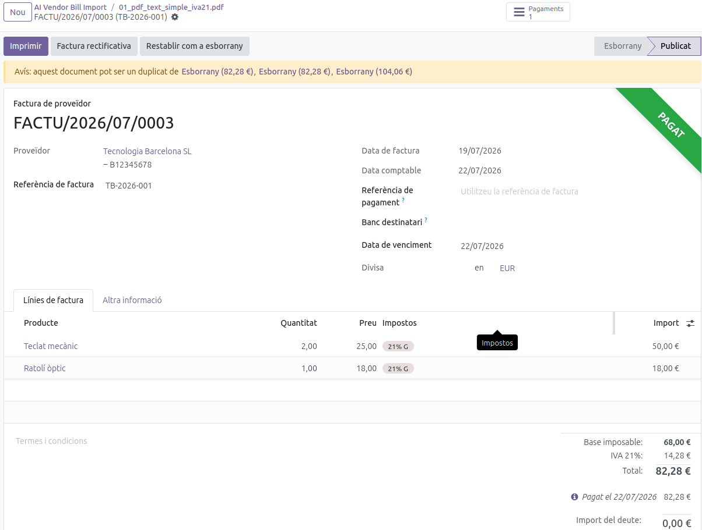
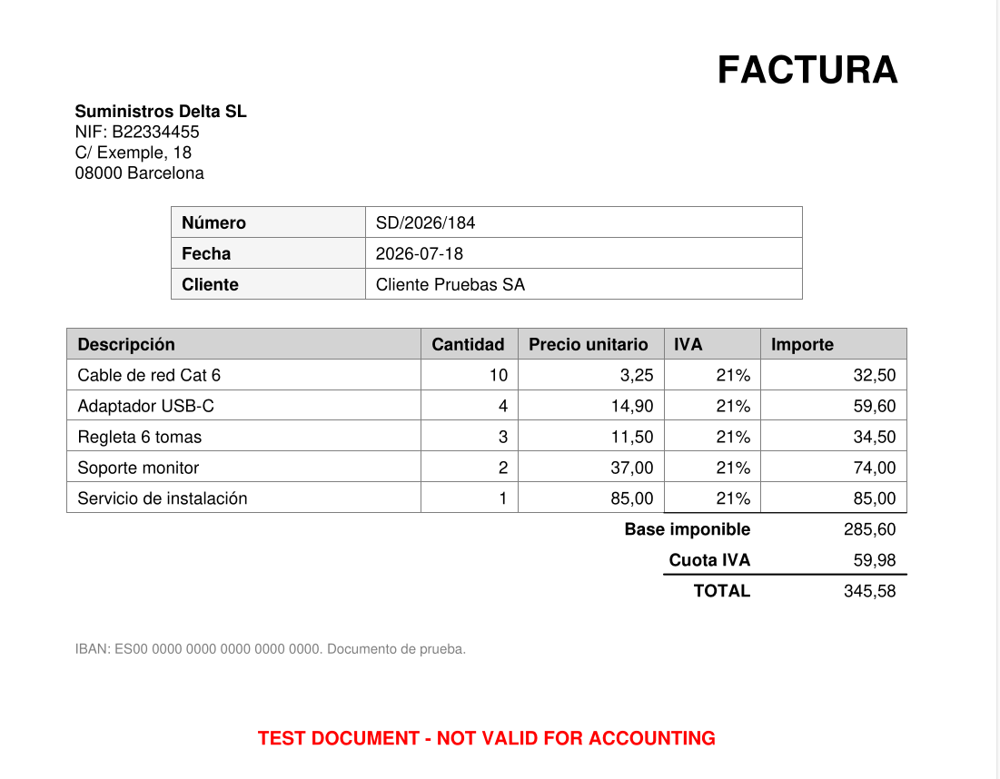
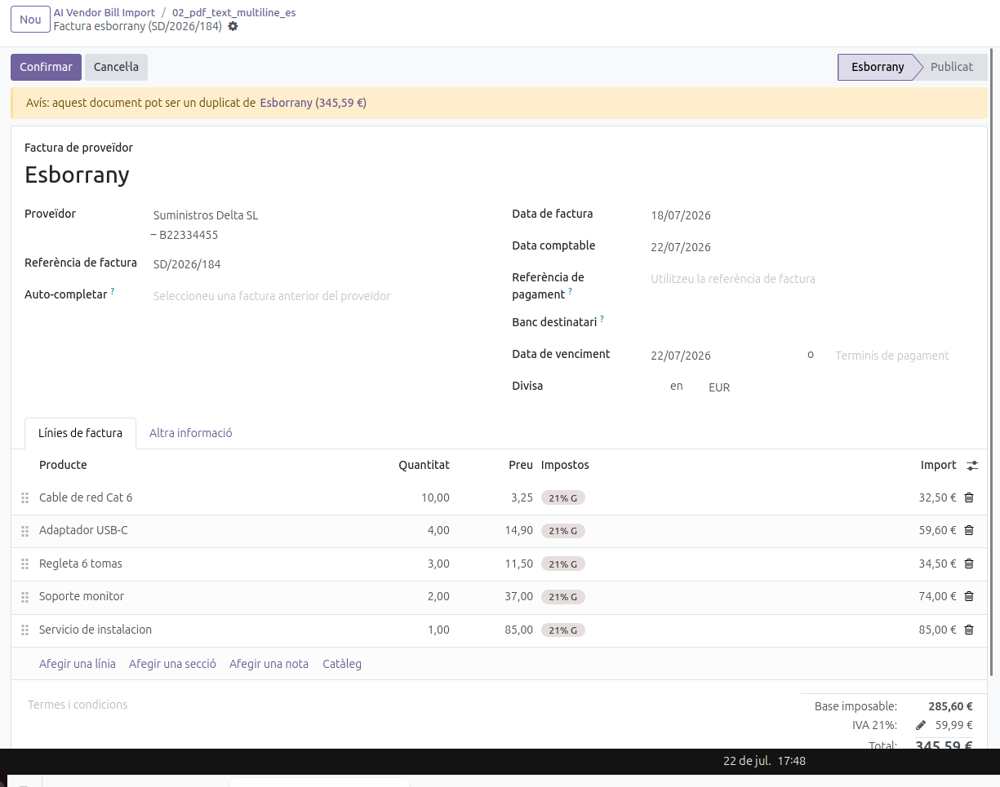
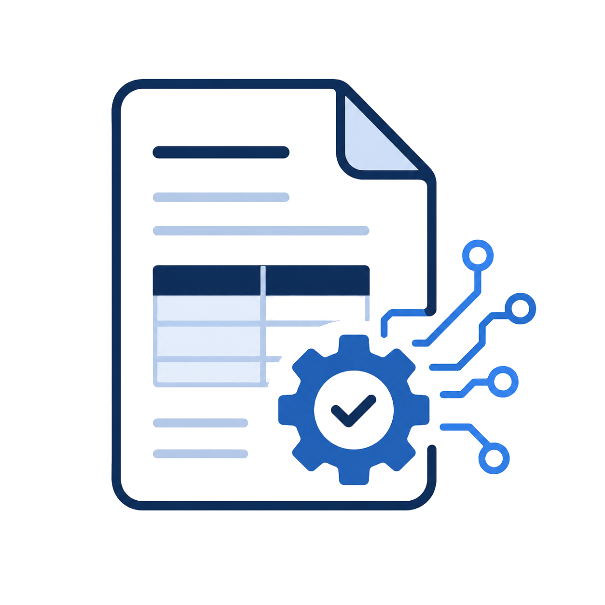

# AI Vendor Bill Import for Odoo 18

An Odoo 18 module that automatically imports supplier invoices using OCR and a local Large Language Model (Ollama).

The module extracts key invoice information, validates the results and creates a Vendor Bill in Odoo with minimal user interaction.



## Demo

[](https://youtu.be/UxhYnOoMLi0)

## Features

* Import invoices in multiple formats:

  * PDF (digital)
  * PDF (scanned)
  * JPG
  * JPEG
  * PNG
* Automatic OCR

  * Native PDF text extraction (PyMuPDF)
  * Image OCR fallback (Tesseract)
* AI-powered invoice parsing using Ollama (Llama 3.2)
* Automatic extraction of:

  * Vendor
  * Invoice number
  * Invoice date
  * Base amount
  * Tax amount
  * Total amount
* Automatic Vendor Bill creation (`account.move`)
* Manual review before validation
* Works entirely locally (no OpenAI API required)


## Technology Stack

* Odoo 18
* Python
* Docker
* PostgreSQL
* PyMuPDF
* Tesseract OCR
* Ollama
* Llama 3.2

## Architecture

```text
PDF
 │
 ▼
OCR
 │
 ├── PyMuPDF
 └── Tesseract
 │
 ▼
Extracted Text
 │
 ▼
Regex preprocessing
 │
 ▼
Ollama (Llama 3.2)
 │
 ▼
Structured JSON
 │
 ▼
Odoo Vendor Bill
```

## Installation

```bash
docker compose up -d
```

Start Ollama:

```bash
OLLAMA_HOST=0.0.0.0:11434 ollama serve
```

Install the module in Odoo.

## Screenshots

### Invoice



### OCR Result



### Module Icon



## Testing

The module has been tested with multiple invoice types including:

* Digital PDFs
* Scanned invoices
* Low-resolution documents
* Tilted documents
* Shadowed scans

The extraction pipeline successfully handles the vast majority of common supplier invoices.

## Validation

The module was validated with more than 15 invoices covering different real-world scenarios, including:

* Digital PDFs
* Scanned PDFs
* JPG and PNG images
* Smartphone photos
* Low-resolution documents
* Tilted documents
* Shadowed documents

The extraction pipeline performs reliably on standard invoices. More challenging image conditions (such as severe shadows, strong perspective distortion, or very low resolution) remain areas for future improvement.


## Future Improvements

* Automatic invoice lines extraction
* Multi-currency support
* Confidence score per extracted field
* Multi-language prompts
* Batch invoice import

## Repository Goals

This project demonstrates:

* OCR integration
* Local AI integration
* Odoo backend development
* Accounting integration
* Docker deployment
* Production-oriented workflow

## License

MIT
